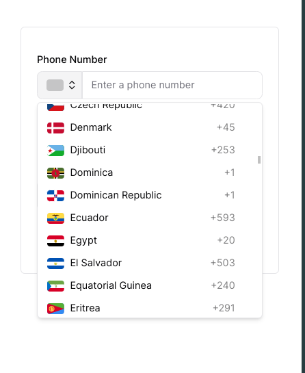

## Phone input component

Custom shadcn/ui wrapper around [react-phone-number-input](https://www.npmjs.com/package/react-phone-number-input).

Component is 20rem wide, which we believe is ideal, thus fixed at it.

To use, copy and paste the component right into your project. [Click to navigate.](./components/ui/phone-input.tsx)
